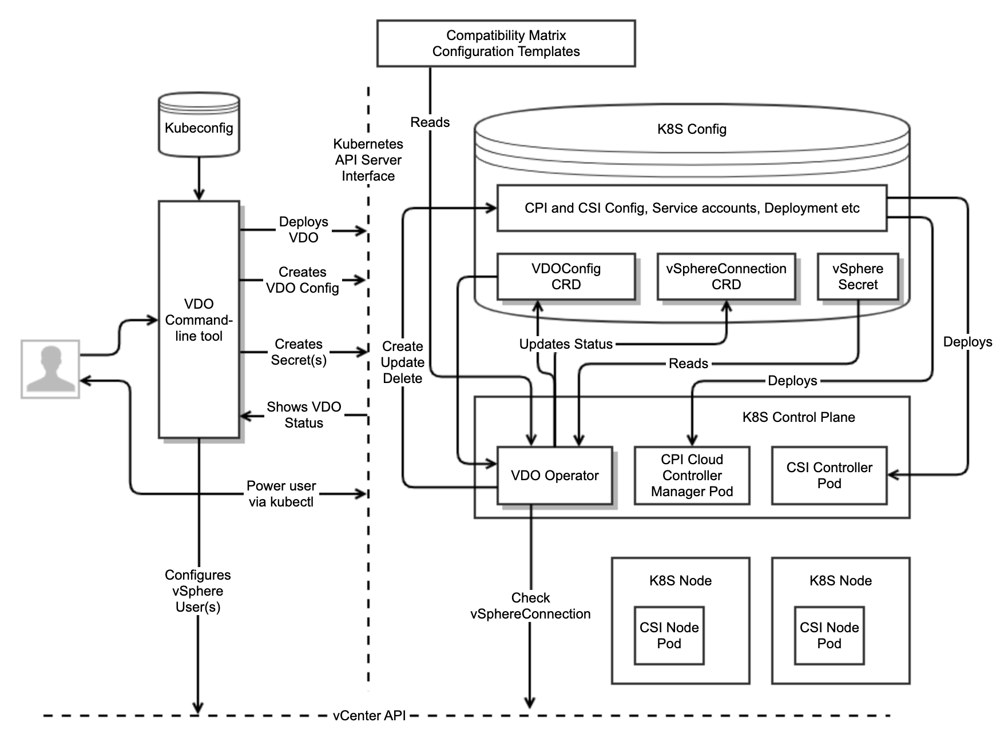

# Architecture

## Background

Kubernetes Operators are an increasingly popular and common form of extending Kubernetes and have become a
defacto standard for OpenShift, as can be seen at [OperatorHub.io](https://operatorhub.io/).

In order for a Kubernetes cluster to function on vSphere, in many (but not all) circumstances it
must authenticate with the vCenter control plane. The most common reason for doing this is so that
Kubernetes can allocate Volumes, either as block devices on a vSphere Datastore or if it wants to
use a [vSAN fileshare](https://vsphere-csi-driver.sigs.k8s.io/driver-deployment/installation.html#vsphere-configuration-file-for-file-volumes-).
Integrated solutions on vSphere such as TKG-S do this authentication automatically,
however for 3rd-party solutions, it must be done manually.

Kubernetes has some important abstractions that have evolved over the years:

**CPI** - The [Cloud Provider](https://github.com/kubernetes/cloud-provider) abstraction.
This is intended to be the interface between Kubernetes and the underlying Cloud fabric,
designed primarily for things like allocating layer 4 load-balanced services, checking
the existence of virtualized nodes and persistent storage. Over time, the storage part
moved out into CSI. vSphere has a [CPI driver](https://github.com/kubernetes/cloud-provider-vsphere). 

**CSI** - The [Container Storage](https://kubernetes-csi.github.io/docs/) abstraction. 
This is intended to provide an abstraction layer for different types of persistent storage. 
vSphere has a [CSI driver](https://github.com/kubernetes-sigs/vsphere-csi-driver).

**CNI** - The [Container Network](https://github.com/containernetworking/cni) abstraction.
CNI was defined independent of Kubernetes, but Kubernetes has standardized on it as a means
of defining how containers can be networked together. There is an
[NSX-T CNI driver](https://docs.vmware.com/en/VMware-NSX-T-Data-Center/2.4/com.vmware.nsxt.ncp_kubernetes.doc/GUID-22D54FC5-4B06-4FE1-86A9-96A953FA15B9.html)
called NCP that uses Open vSwitch and there is also an [Antrea CNI driver](https://github.com/antrea-io/antrea).
Any CNI can be used with Kubernetes on vSphere for inter-container communication,
but if layer 4 load-balancing is required, this has to be integrated with a
load balancer control plane such as the ones in HAProxy or AVI.

There is already an [Open Source Operator for the Antrea CNI driver](https://github.com/vmware/antrea-operator-for-kubernetes).

## Business Problem

Deploying a non-VMware Kubernetes distribution to vSphere and manually installing the drivers
is not currently a good user experience. There are many issues such as:

- Out of date documentation
- No common authentication format
- Opinionated and convoluted configuration file formats
- Manually match the driver versions with the vSphere and Kubernetes versions
- Difficulty of configuring vSphere with a user that has access controls with least privilege
- The need to install GOVC and manually configure VMs with specific properties
- The need to understand how to match vSphere and Kubernetes Region/Zone configuration
- The need to pre-configure kubeadm with obscure options
- Confusing and misleading error messages

Some of these issues can be fixed relatively easily by updating the documentation, improving error messages
and decoupling CSI from CPI. However, our users and partners expect more than this and have requested that
we create a Kubernetes Operator that automatically handles the majority of tasks that currently must be done manually.

The primary objective of this architecture is to create an Operator that satisfies the requirements for OpenShift

## Goals

**Primary goal**: To create a Kubernetes Operator (VDO) that automatically handles the installation and
upgrade of the necessary vSphere drivers, requiring a minimum of input for the user. VDO will have the following characteristics:

- Designed to work with RedHat and vanilla Kubernetes clusters. This means it must be coded against the
[OpenShift Operator SDK](https://github.com/operator-framework/operator-sdk)
- Will reach the "Seamless Upgrades" capability level defined in the
[Openshift Operator maturity model](https://docs.openshift.com/container-platform/4.1/applications/operators/olm-what-operators-are.html#olm-maturity-model_olm-what-operators-are)
- Configuration of VDO is designed for the 90% of users who want to get up and running quickly.
Power users will be able to configure a larger subset of advanced options
- Health and monitoring should be front and center of every aspect of the user experience.
If something is not working, it should be clear and obvious how to remedy it
- Automatically chooses appropriate driver versions to install or upgrade based on an online
compatibility matrix, which is independent of operator releases
- Is capable of working in air-gapped environments or environments with no access to public internet
- Is able to configure a vSphere user with access controls that grant minimum privilege for a given configuration
- Works with any CNI implementation
- Supports vSphere CSI install only (presumably with a 3rd party CPI driver) if no CPI config is created
- Works with any version of vSphere supported by currently maintained CPI and CSI drivers
- Works with any version of Kubernetes supported by currently maintained CPI and CSI drivers
- This project will be developed [fully in the open](https://github.com/vmware-tanzu/vsphere-kubernetes-drivers-operator)

## Non-Goals

- No paravirtual integration with Supervisor in Project Pacific at this time, although it will work in a Kubernetes
deployed to a vSphere cluster enabled for Workload Management.
  - It should be assumed that paravirtual integration will be a future goal of this project.
- No integration of VM Operator, CAPV or Net Operator at this time
- No explicit integration with NCP, rather it remains CNI-agnostic
- No integration with the Antrea Operator (see discussion below)
- No explicit support for other 3rd party Kubernetes distributions other than OpenShift,
although support for vanilla Kubernetes should mean that it will just work
- No integration with load-balancers, although this would be a good future goal
- No support for ensuring that Kubernetes CPI and vSphere Region / Zone configuration matches up
- No support for UI integration with vSphere, although it should be noted that this may be desirable in the medium term

## Proposed Architecture

Here is a high-level diagram of the architecture showing the net new components with a shadow

### VDO Command-line tool

The VDO command-line tool is designed with a few goals in mind:

1. Simplify the deployment of VDO, so that the typical user does not need to have any knowledge about CRD schema,
service accounts, roles, deployments or any boilerplate YAML
    1. Note that power users can choose to apply CRDs and YAML directly via kubectl if they desire
2. Create and manage user accounts in vSphere that VDO will use for the CSI and CPI drivers
    1. User accounts should be created with least privilege
    2. vSphere Admin credentials for the user management would be used for just that specific operation and would not be persisted anywhere
    3. The necessary Secrets for the user account(s) created would then be automatically created in the target Kubernetes cluster
3. Summarize the VDOConfig and vSphereConnection CRD statuses so that the user can get a quick and easy summary. Eg:
    1. Shows the versions of drivers currently installed
    2. Shows the health of the drivers
    3. Shows the vSphere user(s) currently in use and the connection status
4. Provide the option to upgrade the drivers, if an upgraded version is available. There are two mechanisms by which this can be achieved
    1. By downloading an updated version of the command-line tool, which should contain the latest configuration
matrix and configuration templates. The tool can then apply an update to the VDO config. VDO then takes responsibility
for updating the drivers. This is the *Static* method (see below)
    3. By updating an online version of the compatibility matrix that VDO is watching. VDO should then automatically
update the drivers. This is the *Dynamic* method (see below)
5. Provide the option to upgrade the VDO driver
    1. Since the VDO command-line tool and VDO deployment are intentionally tightly-coupled, you update one by updating the other.

We would expect the VDO command-line tool to be tightly-coupled to the VDO operator and as such will be a part of the same project,
using the same version numbers. As such, the command-line tool will upgrade/downgrade the VDO operator by virtue of the
Deployment/Pod/Container config that it generates. Thus if a user wants to upgrade their VDO, they only need to update the command-line tool.

The VDO command-line tool authenticates with a Kubernetes cluster using a kubeconfig file, just like kubectl.

The VDO command-line tool should block when it is deploying VDO and it should report simple status summary back to the
command-line. It should not return until the drivers have installed successfully. While this is not the expected UX for
power-uses with kubectl who expect asynchronous operation, it is a more natural UX for average users who would expect scripts
to block until they've completed. The command-line tool should respond to signals in the way the user would expect and if
the user does choose to kill the command-line tool during install (for example if the install is not succeeding), the
operation will continue asynchronously in the background and they can use the command-line tool to report on the status.

